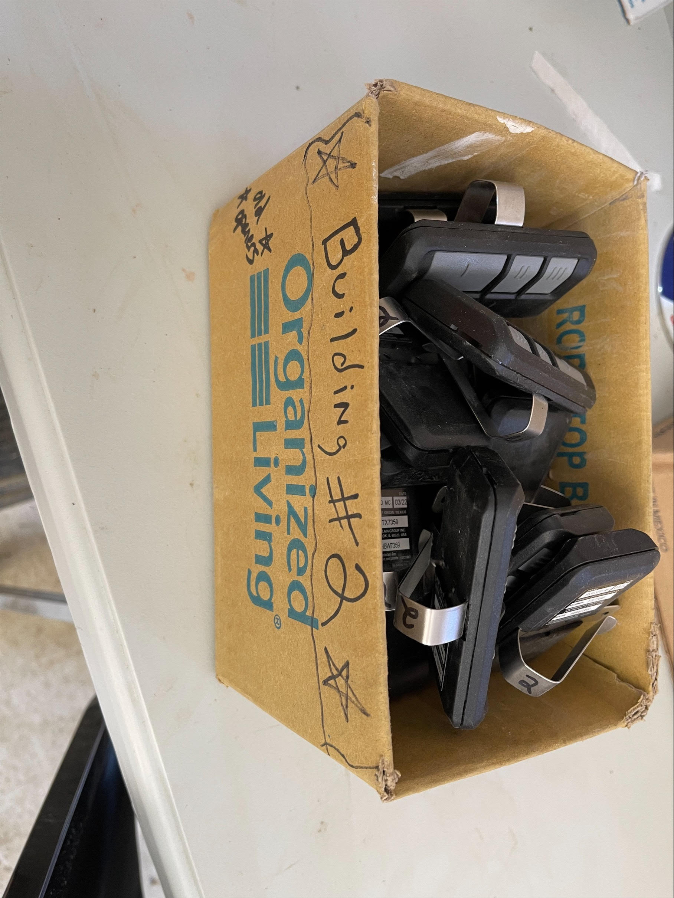

# SoFi Robo Advisors Case Study

## Overview and Origin

* Social Finance Inc. or SoFi

* SoFi was founded in the summer of 2011 by Mike Cagney, Dan Macklin, James Finnigan, and Ian Brady, four students who met at the Stanford Graduate School of Business.

* The founders hoped SoFi could provide more affordable options for those taking on debt to fund their education. The company's loan program was a pilot at Stanford; for this pilot program, 40 alumni loaned about $2 million to approximately 100 students, for an average of $20,000 per student.

* In May 2012 SoFi becomes the first company to introduce refinancing of federal and private student loans.

* In September 2012, SoFi raised $77.2 million from Baseline Ventures along with several other private investors.

## Business Activities:

* SoFi wealth was launched in 2017, to help young families and couples to prepare for retirement, or life events like buying a first home.

* Who is the company's intended customer?  Is there any information about the market size of this set of customers?
What solution does this company offer that their competitors do not or cannot offer? (What is the unfair advantage they utilize?)

* Which technologies are they currently using, and how are they implementing them? (This may take a little bit of sleuthing–– you may want to search the company’s engineering blog or use sites like Stackshare to find this information.)

## Landscape:

* What domain of the financial industry is the company in?

* What have been the major trends and innovations of this domain over the last 5-10 years?

* What are the other major companies in this domain?

## Results

* What has been the business impact of this company so far?

* What are some of the core metrics that companies in this domain use to measure success? How is your company performing, based on these metrics?

* How is your company performing relative to competitors in the same domain?

## Recommendations

* If you were to advise the company, what products or services would you suggest they offer? (This could be something that a competitor offers, or use your imagination!)

* Why do you think that offering this product or service would benefit the company?

* What technologies would this additional product or service utilize?

* Why are these technologies appropriate for your solution?

