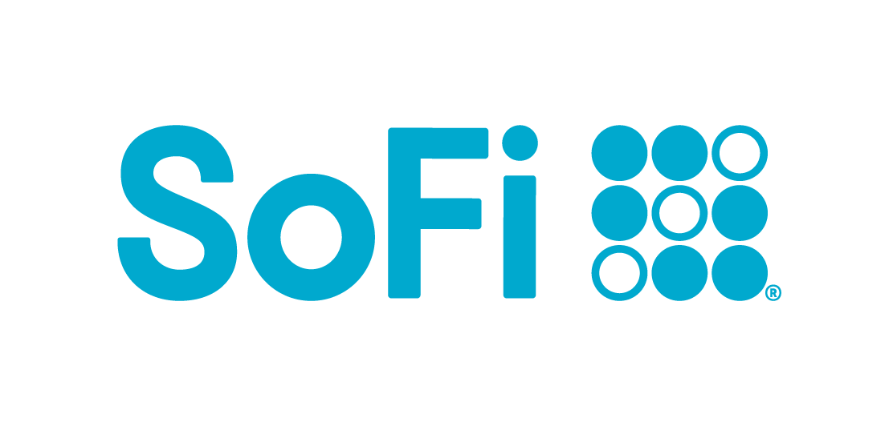
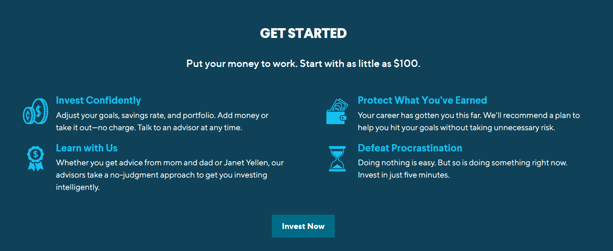
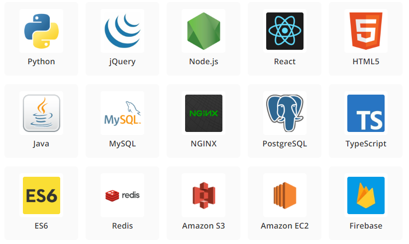
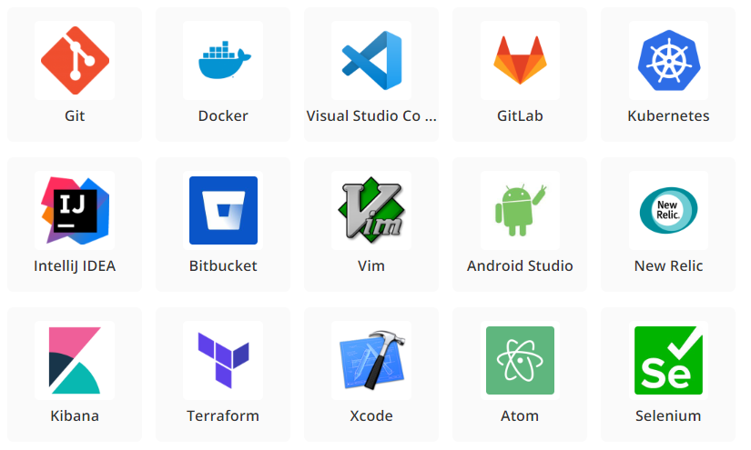
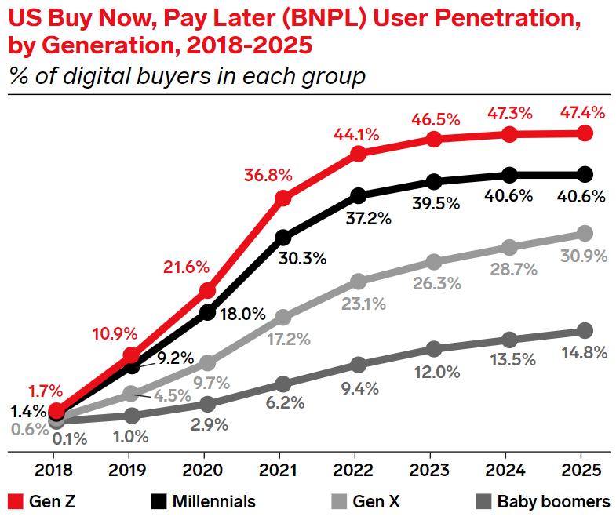
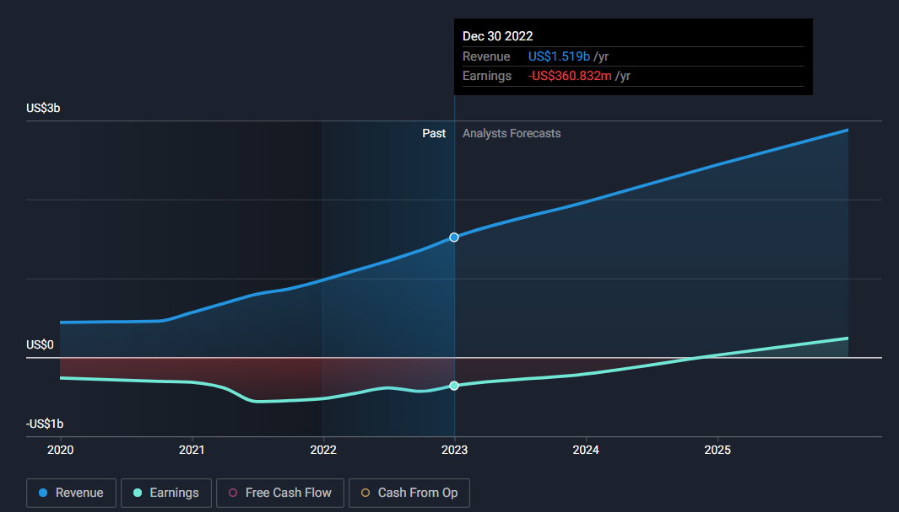
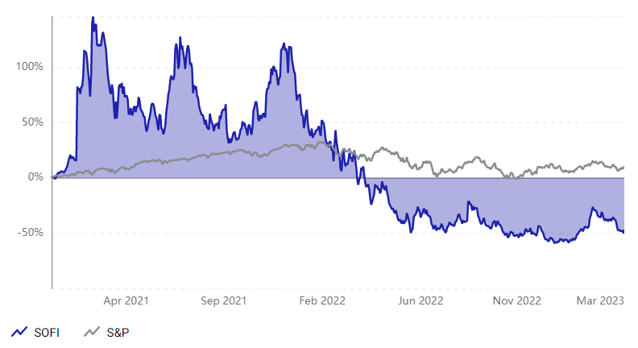
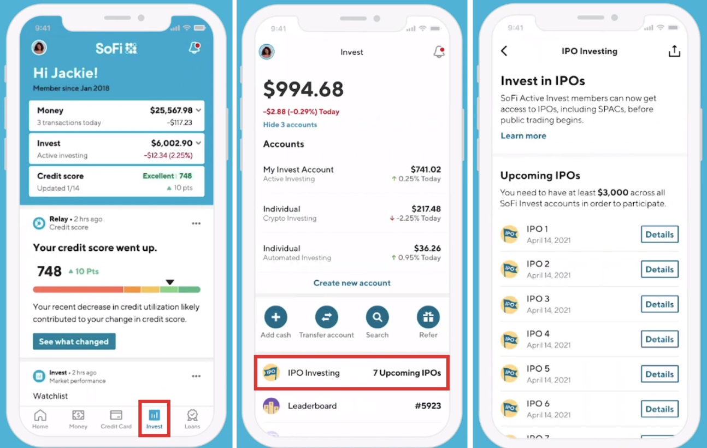

# SoFi Technologies, Inc.
#### NASDAQ : SOFI 
#### EPS -0.24   
#### Market Cap $5.21B
 

## Overview and Origin

* **`SoFi`** was founded in the summer of 2011 by **Mike Cagney**, **Dan Macklin**, **James Finnigan**, and **Ian Brady**, four students who met at the ***Stanford Graduate School*** of Business.

* The founders hoped `SoFi` could provide more affordable options for those taking on debt to fund their education. The company's loan program was a pilot at Stanford; for this pilot program, 40 alumni loaned about $2 million to approximately 100 students, for an average of $20,000 per student.

* In May 2012 `SoFi` becomes the first company to introduce refinancing of federal and private student loans.

* In September 2012, `SoFi` raised $77.2 million from `Baseline Ventures` along with several other private investors.

## Business Activities:

* `SoFi` wealth was launched in 2017, to help young families and couples to prepare for retirement, or life events like buying a first home.

* The intedned customer of `SoFi` is millenials and young families, which comprise over 55% of their customer base.
There are over 80 million people in the US alone who fit this group, giving company plenty of room for growth.

* What makes `SoFi` appealing is their relations with customers: zero-commission trading, financial planning, 1 on 1 customer support, and career services.
All of these exlusive perks are accessible to customers at no cost, while traditional institutions would charge hefty fees. 

* `SoFi` has a massive technical stack, the coding languages go from **Python** to **Swift**. 

* As for the devops, they use **GitLab**, **VS Code**, **Docker** and many other tools.

* The engineers use both quantitative and qualitative information (i.e. what their members are doing in the app, what are they giving as feedback already, and what are some open needs they have) which helps them better understand the member and where the team should focus.

* For instanse, **Senior Staff Engineer**, ***Donald Cestnik*** has this to say about prioritizing certain security aspects, which were addressed because customer data analysis was utilized:
"***Accurately identifying fraud and providing risk scoring keeps our costs down and boosts trust.***"

## Landscape:

* `SoFi` started out in the lending domain, but quickly expanded to other services, including ***Investment Management, Blockchain and Cryptocurrencies, Capital Investment and Robo-Advising.***

* Over the past years the lending industry quickly evolved, thanks to advances in **Big Data** and **AI**, which are now being used to determine creditworthiness of an individual or a company. 

* Banks typically turn to credit bureaus or company accounts to inform their decisions. This means they are constrained by a narrowly-defined data set that leaves them little room for manoeuvre. Fintechs, by contrast, base their decisions on a much wider set of parameters. A case in point is `SoFi`, which utilizes large datasets to make their decisions.

* But competition in the lending space is still fierce: in recent years a new model started emerging: **Buy Now Pay Later**, with `Affirm`, at 2.87B market cap, being the clear leader and innovator. Other competitors include companies like `Klarna`, `LightStream` and even `PayPal`.

## Results

* `SoFi` has been growing at a very impressive rate since it was founded. Thanks to smart business decisions and a robust model, built on customer trust, SoFi generated 521 million of assets under management as of 2021

* One of the most important KPIs for banks (which is a large part of `SoFi's` business model), is **net interest margin** (NIM), which reveals a bank's net profit on interest-earning assets, such as loans or investment securities.

* `SoFI` has a NIM of **6.5%**, which is impressive, when compared to the industry average of **3.5%**, although it is still comparatively tiny in terms of assets under management.

* Also, `SoFi` is still unprofitable, with a reported loss of **$320.4 Million dollars** in 2022. This is mainly due to the Silicon Valley's "Grow Now, Turn Profit Later" approach, which fell out of favor after the Fed started tightening it's monetary policy. 

* The sudden change in market sentiment lead to `SoFi` losing around 70% of it's stock value since the peak of 2021. 

## Recommendations

* There are many ways `SoFi` could expand, one of them being the aforementioned **Buy Now Pay Later model**, which is mainly being used by young adults - their target demographic. 

* Improving and expanding their services as a trading platofrm is also worth considering, as there is a lot of correlation with the demographic of Robinhood and Webull. This wouldn't be especially cost heavy, since `SoFi` already has a robust trading app, and with some polish it could become the app of choice for millenials and gen-z.

* While UI/UX side of `SoFi` apps looks clean, it does not feel intuitive and simple to navigate (which made Robinhood successul). Utilizing customer experience sureys to improve that aspect would go a long way.

# Main Research Materials
* [Wikipedia](https://en.wikipedia.org/wiki/SoFi)
* [SoFi Website](https://www.sofi.com/)
* [Seeking Alpha](https://seekingalpha.com/symbol/SOFI/income-statement)
* [Stackshare](https://stackshare.io/sofi/sofi)
* [The Business Model Analyst](https://businessmodelanalyst.com/sofi-business-model/)
* [The Motley Fool](https://www.fool.com/investing/2022/12/04/why-sofi-technologies-lost-11-in-november/)

